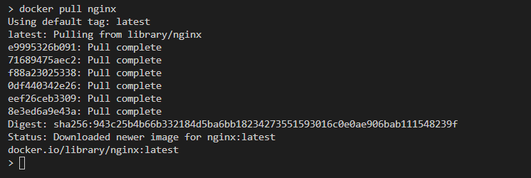

# Report

## Part 1. Ready-made docker

- making shure that docker is installed and docker engine is running
- getting nginx:
    
    

- check for the docker image with 'docker images':

    

- run docker image with 'docker run -d [image_id|repository]' and check that the image is running with 'docker ps':

    

- view container information with 'docker inspect [container_id|container_name]':

    

- - size:
 
    

- - ip:

    

- - list of mapped ports:

    

- stop docker image with 'docker stop [container_id|container_name]' and check that the image has stopped with 'docker ps'
    
    

- run docker with mapped ports 80 and 443 on the local machine with 'run' command:

    

- check that the nginx start page is available in the browser at localhost:80:

    